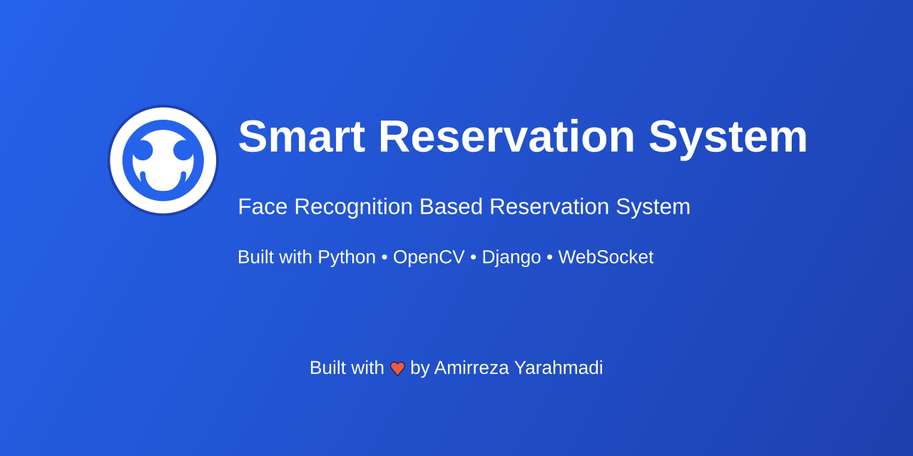

# Smart Reservation Project - Backend 🚀

[](https://www.python.org/downloads/)
[](https://opensource.org/licenses/MIT)
[](https://opencv.org/)
[](https://websockets.readthedocs.io/)
[](https://github.com/ageitgey/face_recognition)

<div align="center">
  
  <br>
  
  <br>
  
  
  
</div>

## 📝 Overview

This repository contains the backend implementation of the Smart Reservation Project, a cutting-edge face recognition-based reservation system that combines OpenCV, WebSocket, and Django to provide automated check-in, secure access control, and smart attendance tracking. Features real-time face detection, WebSocket communication for instant updates, and a scalable architecture. Perfect for businesses looking to implement modern, contactless verification systems with high accuracy and security. Built with Python 3.8+, OpenCV, dlib, and scikit-learn for robust face recognition capabilities.

## ✨ Key Features

- 🔍 **Advanced Face Detection**: Real-time face recognition using state-of-the-art algorithms
- 🔄 **Real-time Communication**: WebSocket-based instant updates and notifications
- 🎯 **High Accuracy**: Machine learning-powered face recognition with high precision
- 🔒 **Secure**: Built with security best practices in mind
- 🚀 **Scalable**: Designed to handle multiple concurrent connections
- 📊 **Easy Integration**: Simple API for seamless integration with existing systems

## 🏗️ Project Structure

```
backend/
├── __face_detector/     # Face detection implementation
├── __websocket_server/  # WebSocket server implementation
├── main.py             # Main application entry point
├── test.py             # Test scripts
└── requirements.txt    # Python dependencies
```

## 🛠️ Technology Stack

- **Python 3.8+**: Core programming language
- **OpenCV**: Computer vision and image processing
- **dlib**: Face detection and recognition
- **WebSocket**: Real-time bidirectional communication
- **Django**: Web framework integration
- **NumPy & SciPy**: Scientific computing
- **scikit-learn**: Machine learning capabilities

## 🚀 Getting Started

### Prerequisites

- Python 3.8 or higher
- OpenCV
- Django
- WebSocket libraries

### Installation

1. Clone the repository:
```bash
git clone https://github.com/amirreza-yar/smart-reservation.git
cd smart-reservation/backend
```

2. Create and activate a virtual environment:
```bash
python -m venv .venv
source .venv/bin/activate  # On Linux/Mac
# or
.venv\Scripts\activate  # On Windows
```

3. Install dependencies:
```bash
pip install -r requirements.txt
```

### Usage

1. Start the main application:
```bash
python main.py
```

2. Run tests:
```bash
python test.py
```

## 📚 Documentation

Detailed documentation is available in the following locations:
- [API Documentation](docs/api.md)
- [Setup Guide](docs/setup.md)
- [Contributing Guidelines](CONTRIBUTING.md)

## 🤝 Contributing

We welcome contributions! Please see our [Contributing Guidelines](CONTRIBUTING.md) for details.

1. Fork the repository
2. Create your feature branch (`git checkout -b feature/AmazingFeature`)
3. Commit your changes (`git commit -m 'Add some AmazingFeature'`)
4. Push to the branch (`git push origin feature/AmazingFeature`)
5. Open a Pull Request

## 📝 License

This project is licensed under the MIT License - see the [LICENSE](LICENSE) file for details.

## 👥 Author

- **Amirreza Yarahmadi** - *Creator & Maintainer* - [GitHub](https://github.com/amirreza-yar)

## 🙏 Acknowledgments

- Thanks to all contributors who have helped shape this project
- Inspired by modern face recognition systems
- Built with the support of the open-source community

## 📞 Contact & Support

- 📧 Email: [yar.amirreza@gmail.com](mailto:yar.amirreza@gmail.com)
- 💬 Telegram: [@Amirrz_yar](https://t.me/Amirrz_yar)
- 👨‍💻 GitHub: [@amirreza-yar](https://github.com/amirreza-yar)
- 💼 LinkedIn: [Amirreza Yarahmadi](https://www.linkedin.com/in/amirreza-yarahmadi/)
- 📝 Issues: [GitHub Issues](https://github.com/amirreza-yar/smart-reservation/issues)

## ⭐ Show your support

Give a ⭐️ if this project helped you!

---

<div align="center">
  <sub>Built with ❤️ by <a href="https://github.com/amirreza-yar">Amirreza Yarahmadi</a></sub>
</div> 